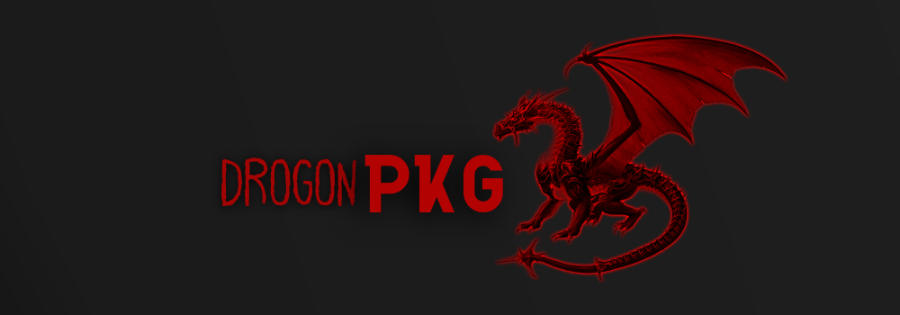

<div id="top"></div>

<!-- PROJECT LOGO -->
<br />
<div align="center">
  <h3 align="center">Drogon Package Manager 📦</h3>
   ⚠️Attention this project is still under constant development, this entire guide may be changed.
  <p align="center">
    <br />
    <a href="https://github.com/midnightxd/frost_pkg/issues">Report Bug</a>
    ·
    <a href="https://github.com/midnightxd/frost_pkg/issues">Request Feature</a>
  </p>
</div>

<!-- ABOUT THE PROJECT -->
## About The Project
> DrogonPKG is a low-level package manager for linux written sh



<p align="right">(<a href="#top">back to top</a>)</p>

<!-- GETTING STARTED -->
<div id="getting-started">

## Getting Started

#### Prerequisites for frost pkg


## Manual installation

Clone the repository
```sh
$ git clone https://github.com/darkstar-x/drogon-pkg.git
```
As ROOT, create the directories
```sh
# mv drogon /usr/sbin
```
## Usage

```sh
drogon --help

